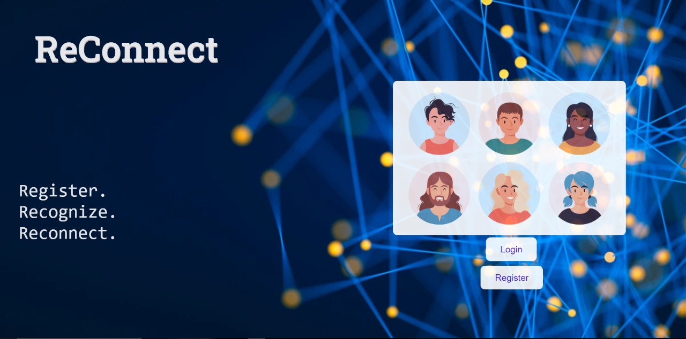
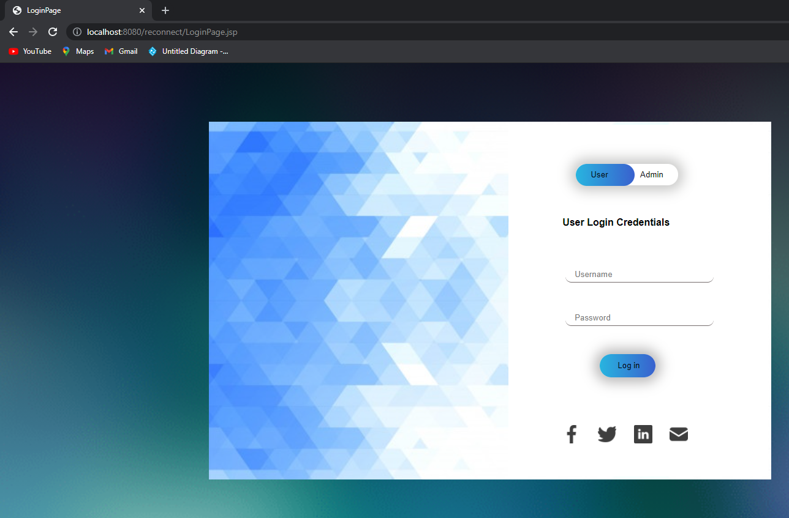

# Reconnect

## About the project:

The web-based application allows users to add and manage contacts. The
application supports unlimited users and provides several features for
socializing.

#### The system supports two types of users:

-   System administrator : Can monitor activities of the users, they do
     not have access the users and contacts database information.

-   Application Users : Can create a profile in the system and add their
    contacts to the same. They can have friends and performs various
     activities.

#### Terminologies

-   System Administrator: The administrator of the application.

-   Users: Those who have registered to the system and can login and performs certain tasks

-   Contacts: These are contacts added by a user to the system which will reside in the contacts list of that user only. A contact for a user could also be another registered user of the system

-   Friends: A (registered) User can search for other users and send
-   friend requests. If the request is accepted, they become friends

-   Friends are (registered) Users of the system.

#### Applications Features

-   Users must register to the system

-   Registered users can add and maintain their contacts in the system.

-   This information is private to that user, no other user or
     administrator can view the contact list information.

-   Registered users can search the system for other registered users
     based on name/location etc.

-   The system will show the basic information of users in the search
     results like name and profile image.

-   A friend request can be sent to anyone in the system unless they
     have blocked the user.

-   If the request is accepted, then the user can view the full
     information of the newly added friend.

-   System administrator cannot view or modify the user's database; They
     can disable or delete users .

## Built With:

Ide Used:Eclipse\[Enterprise Edition\]

Java version:1.8

Architecture:Maven

Server:tomcat 9.0

Database:mysql -version:8.0.20

Getting Started:

### Prerequisites:

[Eclipse Ide](https://www.eclipse.org/downloads/) Download eclipse ide according to you system requirements

[Java 8](https://www.oracle.com/java/technologies/downloads/)

[Mysql](https://www.mysql.com/downloads/)

## Installation:

Creating Database

Step 1:

Open mysql command prompt or mysql workbench

Step 2:

Login as Administator Use command mysql -u \<username> -p (password if required)

Step 3:

Copy paste the commands mentioned in the link :

[database](https://docs.google.com/document/d/1PBZghdAOYe4YpV59qCA5nFp78hdijFdL0WLj2TBO0ac/edit)

## Importing the Project and running it

Step 1:

Clone the repository :

[https://github.com/vaishnavi1401/Divide-n-ConquErors.git](https://github.com/vaishnavi1401/Divide-n-ConquErors.git)

Step 2:

In Eclipse

Click on File \> import Project \> Maven \> existing maven Project>path
to the folder

Step 3:

In created Project Add tomcat server and java 8 in build path configure

Step 4:

Go Inside \\src\\main\\java\\com\\reconnect\\utility\\DBUtils.java and
change your username and password

Step 5:

Run the Project on your Tomcat Server

## Some Snippets
#### Admin Login:

#### User Login:

#### Landing Page:

#### Login Page:

